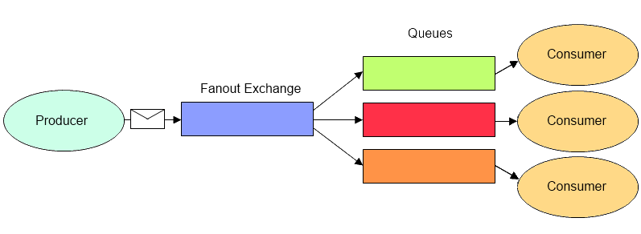

# TP Rabbit MQ

参考书籍　RabbitMQ in Action

## 3.1 Premier exemple : "Hello world"

Nous allons maintenant voir si RabbitMQ est sensible à l'ordre des appels. Pour cela, lancez:

- le récepteur puis l'émetteur
- l'émetteur puis le récepteur

Que se passe-t-il ? comment peut on expliquer cette situation ?

先运行sender.py，再运行recieve.py，接收者收到一次hello world消息
多次运行sender.py，Queue大小会增加，之后再运行recieve.py，它会一下消耗所有的message

## 3.1 Second exemple : "work queue"

Avec cet exemple, nous allons aussi voir comment RabbitMQ se comporte lorsqu'un processus client
qui consomme un message se plante. Pour identifier cela, vous pourrez programmer une
temporisation (avec un certain nombre de "." dans la chaine en entrée pour simuler une attente en
lien avec l'exécution du traitement du message du coté du receveur) et puis arrêter le programme
avec un CTL-C. Que se passe-t-il ? est ce que la donnée qu'il traitait est redirigée vers un autre
worker?

信息中包含'.'可导致worker　sleep

```python
time.sleep( body.count('.') )
```

测试
先运行两个worker.py准备接受信息，然后再运行new_task.py来发送信息。在第一个worker　sleep时关闭进程，第二个worker会收到信息。之后再打开刚刚关闭的worker，它不会再收到信息

vous pouvez aussi voir ce qui se passe si vous activez 2 récepteurs (worker.py) et 2 émetteurs
(new_task.py) et que vous arrêtez un récepteur alors qu'il est en plein traitement ?

```python
channel.basic_qos(prefetch_count=1)
```

表示worker一次能最多接受１个未确认消息，参见[doc](https://www.rabbitmq.com/consumer-prefetch.html)

测试
先运行两个worker.py准备接受信息，然后再运行两个new_task.py来发送信息。我们可以看到，由于设置了`prefetch_count=1`，每个worker可以接收到一条信息。然后在一个worker发送回ack前关闭进程，第二个worker在ack后会收到第二条信息。

Regarder l'impact de l'utilisation du 'prefetch' et comment il modifie la politique du tourniquet (ou 'round robin' ? pour cela vous allez activer 2 récepteurs et plusieurs émetteurs : certains demandent des travaux courts (peu de points dans l'argument de la requête), d'autres simulant une demande plus longue (avec plus de "." dans l'argument de la requête).

`prefetch_count=1`简单的load balancing

## 3.3 Troisième exemple : "publish subscribe"



Comme nous avons un nombre quelconque de clients (et consommateurs de données depuis la file d'attente), nous allons créer une file d'attente temporaire. Regardez en particulier dans le code comment la durée de vie de la file d'attente est fixée avec l'attribut "exclusive".

```python
# once we disconnect the consumer the queue should be deleted. There's an exclusive flag for that:
result = channel.queue_declare(exclusive=True)
```

## 3.4 Quatrième exemple : "routing"

Dans cet exemple, nous allons affiner la programmation d'un exchange et voir comment des files
d'attentes peuvent y être reliées. Nous allons ensuite produire des messages dans l'exchange qui
vont être routés en fonction de la valeur de la clé de routage ('routing key').
Pour mettre en évidence ce routage, lancez par exemple 2 récepteurs avec des attentes de type de
messages différents. Vous verrez en particulier que le même message sera propagé vers les
récepteurs qui ont spécifié le message attendu.

先运行receiver再运行sender，如果方向倒过来，则receiver不能收到消息，因为在receiver端实现exchange和queue的binding

## 3.5 Cinquième exemple : "topics"

